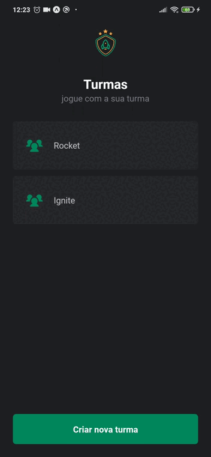

  

  

   
  

<h2>🚀 Descrição</h2>

  
Aplicativo de criação e gerenciamento de times desenvolvido no Bootcamp Ignite da Rocketseat, na trilha de React Native.

<h2>🛠 Tecnologias</h2>

 Tecnologias utilizadas para a criação da aplicação

<u>
 <li>
  <a href='https://expo.dev/' target="_blank" rel="nofollow">Expo</a>
 </li>
 <li>
  <a href='https://www.typescriptlang.org/' target="_blank" rel="nofollow">TypeScript</a>
 </li>
 <li>
  <a href='https://styled-components.com/' target="_blank" rel="nofollow">Styled Components</a>
 </li>
 <li>
  <a href='https://reactnavigation.org/' target="_blank" rel="nofollow">React Navigation</a>
 </li>
 <li>
  <a href='https://react-native-async-storage.github.io/async-storage/' target="_blank" rel="nofollow">Async Storage</a>
 </li>
 <li>
  <a href='https://github.com/duongdev/phosphor-react-native' target="_blank" rel="nofollow">Phosphor Icons for React Native</a>
 </li>
 
</u>

<h2>🔖 Layout</h2>

Você pode visualizar o layout do projeto através [desse link](https://www.figma.com/file/36F1pcjZq4BlIUvZbMhiwU/Ignite-Teams-(Community)?node-id=37%3A6).

<h2>🔥 Para Clonar o repositório</h2>

No terminal execute o seguinte código: 

 <pre>
 git clone https://github.com/rodrigomotamendes/igniteteams
</pre>

<h2>🔥 Executando o projeto</h2>

Utilize o <b>yarn</b> ou o <b>npm install</b> para instalar as dependências do projeto.
Em seguida, inicie o projeto. 

<pre>
npx expo start
</pre>

<h2>💜 Autor</h2>

Projeto criado por <a href='https://www.linkedin.com/in/rodrigo-mota-mendes/' rel="nofollow">rodrigomotamendes</a>

